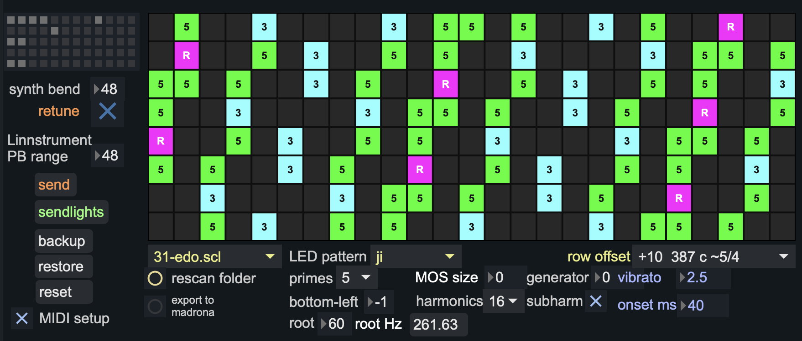

# linnstrument-max

Max 9 patches for the Roger Linn LinnStrument: scales from Scala (`.scl`) files, pad layout and lights, and tuning for MPE synths in Max and for 12-TET hardware.

The terminal app [linnkit](https://github.com/biomassa/linnkit) does the same jobs outside Max. The two share their specs (`docs/`), and the Max code is tested against linnkit's output.

## Which patch to use

Open one of these two patches in `patchers/`. Use one at a time: both listen to the LinnStrument.

| Patch | Use it for |
|---|---|
| `linnstrument.maxpat` | Synth plugins inside Max (`vst~`, for example Madrona Labs Kaivo). Two tuning modes, set with the `retune` toggle: **on** for a plugin tuned to 12-equal (the patch retunes each note with pitch bend, like Live's tuning system); **off** for a plugin that loads the scale itself (notes pass unchanged; the patch converts slides so they land on the pads; `export scale` writes the `.scl` and a matching `.kbm` for Madrona Labs synths). |
| `linnstrument-relay.maxpat` | 12-TET hardware over MIDI (`MIDI out` menu). Targets: **k2600** (Kurzweil K2600 in Multi mode, one note per channel), **mutantbrain** (Hexinverter Mutant Brain, one voice), **generic** (any 12-TET MPE instrument). |

`research_1.maxpat` is an older version kept as a backup.

Both patches have:

- a scale menu filled from `SCL/` (`rescan` re-reads the folder)
- layout and lights for the LinnStrument: row offset, bottom-left note, root note, Bend Range, and 13 light schemes (`docs/light-schemes.md`); `send` writes rows, Bend Range and lights, `sendlights` only the lights
- a preview of the pads with their colours and labels; clicking a pad plays it
- `vibrato` (wider side-to-side vibrato; slides still land on the pads) and `onset ms` (the vibrato widening fades in after each strike)
- presets (the preset grid; slots in `linnstrument.json` and `linnstrument-relay.json`)

## Setup

### LinnStrument

- MIDI mode Channel Per Note (MPE): Y as CC 74, Z as channel pressure.
- Bend Range 48. `send` sets it from the patch's Bend Range box.
- Before its first write, `send` saves every readable setting to `reference/backups/backup.json`. `restore` writes them back. Create the folder `reference/backups/` first; it is not in the repository. Lights go to custom light slot 2 only.

### `linnstrument.maxpat`

- Load the plugin into `vst~` with the `plug` message. The plugin needs MPE input.
- `retune` on: set the plugin to 12-equal, with a per-note bend range of 48.
- `retune` off: press `export scale`, then load the scale from `~/Music/Madrona Labs/Scales/linnstrument/` in the plugin. Set `synth bend` to the plugin's per-note bend range.
- The patch saves the plugin's state. After changing a plugin setting that is not a parameter (for example Kaivo's scale menu), move any knob before saving or storing a preset. Otherwise the old setting is restored.

### `linnstrument-relay.maxpat`

- Choose the MIDI output port in `MIDI out` and the instrument in `target`.
- `voices` limits how many notes play at once (channels 1 to n).
- K2600: MIDI receive mode Multi, the same program on channels 1 to `voices`, pitch bend range 24 semitones (2400 cents), no intonation table.
- Mutant Brain: note input 1 on channel 1, last-note priority, pitch bend ±24. CV A: note input 1 pitch (V/Oct), CV B: note input 1 velocity, CV C: channel aftertouch on channel 1 (pressure), CV D: CC 74 on channel 1 (Y). Notes play in MIDI 24–120 only. `legato` on keeps the gate high when you move to a new pad.

## Contents

| Path | Contents |
|---|---|
| `patchers/linnstrument.maxpat`, `patchers/linnstrument-relay.maxpat` | The two patches to use |
| `patchers/linn.lights.maxpat` + `.js` | Layout, lights, settings and backups on the LinnStrument |
| `patchers/linn.retune.maxpat` + `.js` | Tuning for synth plugins; its script is also the engine of `linn.relay` |
| `patchers/linn.relay.maxpat` | Tuning for 12-TET hardware, output to a MIDI port |
| `patchers/linn.preview.js` | The pad preview (`v8ui`) |
| `patchers/tests/` | Node tests for the scripts, with reference grids printed by linnkit |
| `docs/light-schemes.md` | The light schemes (shared with linnkit) |
| `docs/scala-synth-bends.md` | Bend conversion for synths that load the scale (shared with linnkit) |
| `SCL/` | Scala scale files |

## Requirements

- Max 9.
- A LinnStrument (full size, 200 pads), firmware 2.3.4.
- Node.js, only for the tests.

## Tests

    for t in patchers/tests/*.test.mjs; do node "$t"; done
